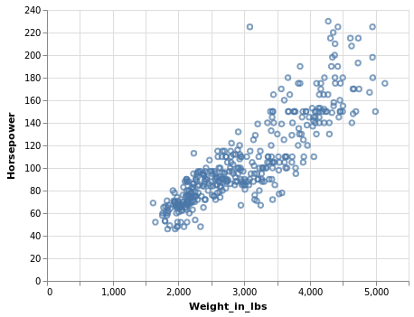

# Making a Scatter Plot
This post will walk you through making a scatter plot in Altair, Matplotlib, and mpl-altair.
We'll examine the cars dataset from [Vega's collection of datasets](https://github.com/vega/vega-datasets#vega-datasets):
```python
from vega_datasets import data
cars = data.cars()
cars.head()
```
**Acceleration** | **Cylinders** | **Displacement** | **Horsepower** | **Miles_per_Gallon** | **Name** | **Origin** | **Weight_in_lbs** | **Year** 
:---: | :---: | :---: | :---: | :---: | :---: | :---: | :---: | :---:
12.0 | 8 | 307.0 | 130.0 | 18.0 | chevrolet chevelle malibu | USA | 3504 | 1970-01-01
11.5 | 8 | 350.0 | 165.0 | 15.0 | buick skylark 320 | USA | 3693 | 1970-01-01
11.0 | 8 | 318.0 | 150.0 | 18.0 | plymouth satellite | USA | 3436 | 1970-01-01
12.0 | 8 | 304.0 | 150.0 | 16.0 | amc rebel sst | USA | 3433 | 1970-01-01
10.5 | 8 | 302.0 | 140.0 | 17.0 | ford torino | USA | 3449 | 1970-01-01

Let's plot Horsepower vs Weight from the cars dataset.

## Altair
```python
import altair as alt
alt.Chart(cars).mark_point().encode(
    alt.X('Weight_in_lbs'),
    alt.Y('Horsepower')
)
```


## Matplotlib
ax.scatter() allows you to specify that your data is being specified as columns from a dataframe via the `data` parameter.

Notice that we have to manually specify the axis labels, the gridlines, and the fact that we want to include zero as our lower limit (Altair defaults to include zero on quantitative axes).
```python
import matplotlib.pyplot as plt
fig, ax = plt.subplots()
ax.scatter('Weight_in_lbs', 'Horsepower', data=cars)
ax.set_xlabel('Weight_in_lbs')
ax.set_ylabel('Horsepower')
ax.set_xlim([0, None])
ax.set_ylim([0, None])
plt.grid()
plt.show()
```


## mpl-altair
To produce the mpl-altair plot, create the Altair chart and then pass it to 
mplaltair's `convert()` function. The resulting fig and ax are Matplotlib objects.
```python
import altair as alt
import matplotlib.pyplot as plt
import mplaltair
chart = alt.Chart(cars).mark_point().encode(
    alt.X('Weight_in_lbs'),
    alt.Y('Horsepower')
)
fig, ax = mplaltair.convert(chart)
plt.show()
```


Why is it beneficial to convert the Altair chart to a Matplotlib figure?
- the figure can be modified using Matplotlib functionality, which has more functionality than Altair (by design)
- the figure can be rendered without Altair's front-end [renderers](https://altair-viz.github.io/user_guide/renderers.html).