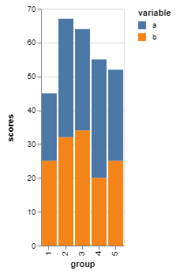
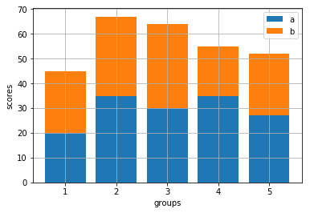

# Making a Bar Chart
At the time of writing, mpl-altair does not support bar charts, so this post will show how to create a bar chart in Altair, Matplotlib, and how mpl-altair _should_ implement bar chart conversion in the future.

We'll work with the following long-form DataFrame for this example:
```python
import pandas as pd
df = pd.DataFrame({
    'group': ['1', '1', '2', '2', '3', '3', '4', '4', '5', '5'],
    'variable': ['a', 'b', 'a', 'b', 'a', 'b', 'a', 'b', 'a', 'b'],
    'scores': [20, 25, 35, 32, 30, 34, 35, 20, 27, 25]
})
```

## Altair
For this dataset, specifying the color will automatically stack the bar charts.
```python
import altair as alt
alt.Chart(df).mark_bar().encode(
    x='group',
    y='scores',
    color='variable'
)
```


## Matplotlib
This is a little more complicated in Matplotlib. Since Matplotlib is procedural, we have to manually tell Matplotlib to stack the bars. Also notice that we are calling a new function now (`ax.bar()`) to get a bar plot.

To stack the bars, we have to create new subset dataframes and then plot each one separately (specifying that bottom of one plot should be the top of another `bottom=a_scores`). One way to do this is to subset via indexing (option 1). Another way to do this is to use the `df.groupby()` function (option 2).
```python
import matplotlib.pyplot as plt
```
```python
# Option 1
fig, ax = plt.subplots()
groups = df['group'].unique()
a_scores = df[df['variable']=='a']['scores']
b_scores = df[df['variable']=='b']['scores']
ax.bar(groups, a_scores, label='a')
ax.bar(groups, b_scores, bottom=a_scores, label='b')
ax.set_xlabel('groups')
ax.set_ylabel('scores')
ax.legend()
plt.grid()
plt.show()
```
```python
# Option 2
fig, ax = plt.subplots()

(_, a), (_, b) = df.groupby('variable')
ax.bar(a['group'], a['scores'], label='a')
ax.bar(b['group'], b['scores'], bottom=a['scores'], label='b')
ax.set_xlabel('groups')
ax.set_ylabel('scores')
ax.legend()
plt.grid()
plt.show()
```
Both produce:




## mpl-altair
At the time of writing, mpl-altair doesn't support bar charts.

If mpl-altair supported bar charts, this is how an Altair chart would get rendered in mpl-altair:
```python
import altair as alt
import matplotlib.pyplot as plt
import mplaltair
chart = alt.Chart(df).mark_bar().encode(
    x='group',
    y='scores',
    color='variable'
)
fig, ax = mplaltair.convert(chart)
plt.show()
```