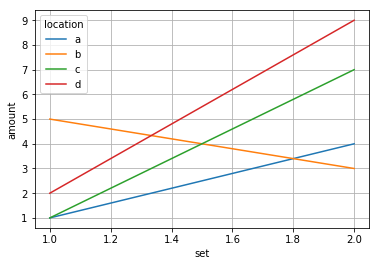

# Making a Line Plot
Altair works best with [long-form](https://altair-viz.github.io/user_guide/data.html#long-form-vs-wide-form-data) data. This is where each row contains a single observation along with all of its metadata stored as values.

Matplotlib works a little better with wide-form data.

Since mpl-altair converts from Altair to Matplotlib, let's look at how to create a line plot using Altair, Matplotlib, and mpl-altair with the following long-form data.

```python
import pandas as pd
df = pd.DataFrame({
    'set': [1, 2, 1, 2, 1, 2, 1, 2],
    'amount': [1, 4, 5, 3, 1, 7, 2, 9],
    'location': ['a', 'a', 'b', 'b', 'c', 'c', 'd', 'd']
})
```

**set** | **amount** | **location**
:---: | :---: | :---:
1 | 1 | a
2 | 4 | a
1 | 5 | b
2 | 3 | b
1 | 1 | c
2 | 7 | c
1 | 2 | d
2 | 9 | d

A possible scenario for this dataset would be an experiment being run in several different locations with 2 measurements taken at each location. The goal with the visualization being to visualize how the amount changed between the two sets of measurements at each location.

## Altair
If we want to plot lines to show how each location changed between set one and set two,
we need to specify the data, tell Altair to plot lines with `mark_line()`, link the x
encoding channel with 'set', the y channel with 'amount', and the color channel with 'location'.
```python
import altair as alt
alt.Chart(df).mark_line().encode(
    alt.X('set'),
    alt.Y('amount'),
    alt.Color('location')
)
```


## Matplotlib
In Matplotlib, just like with a categorical scatter plot, we have to plot a new line for every location.
Specifying a label with each line allows us to generate a legend with `ax.legend()`.
```python
import matplotlib.pyplot as plt
fig, ax = plt.subplots()
for loc, subset in df.groupby('location'):
    ax.plot('set', 'amount', data=subset, label=loc)
ax.set_xlabel('set')
ax.set_ylabel('amount')
ax.legend(title='location')
plt.grid()
plt.show()
```


## mpl-altair
To render the Altair chart using Matplotlib:
```python
import altair as alt
import matplotlib.pyplot as plt
import mplaltair
chart = alt.Chart(df).mark_line().encode(
    alt.X('set'),
    alt.Y('amount'),
    alt.Color('location')
)
fig, ax = mplaltair.convert(chart)
plt.show()
```
