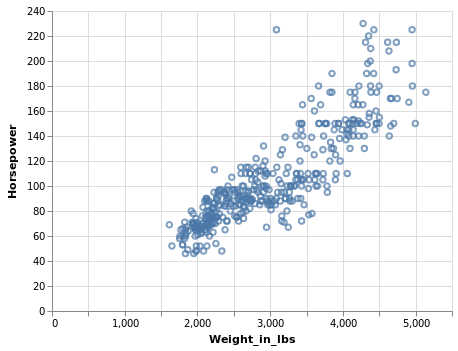
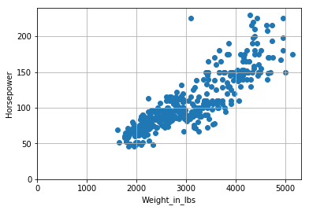
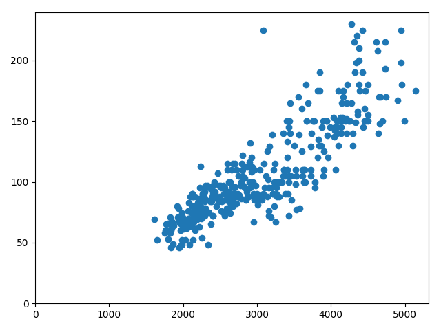

# Making a Scatter Plot
This post will walk you through making a simple scatter plot in Altair, Matplotlib, and mpl-altair.
We'll examine the cars dataset:
```python
from vega_datasets import data
cars = data.cars()
cars.head()
```

<div>
<style scoped>
    .dataframe tbody tr th:only-of-type {
        vertical-align: middle;
    }

    .dataframe tbody tr th {
        vertical-align: top;
    }

    .dataframe thead th {
        text-align: right;
    }
</style>
<table border="1" class="dataframe">
  <thead>
    <tr style="text-align: right;">
      <th></th>
      <th>Acceleration</th>
      <th>Cylinders</th>
      <th>Displacement</th>
      <th>Horsepower</th>
      <th>Miles_per_Gallon</th>
      <th>Name</th>
      <th>Origin</th>
      <th>Weight_in_lbs</th>
      <th>Year</th>
    </tr>
  </thead>
  <tbody>
    <tr>
      <th>0</th>
      <td>12.0</td>
      <td>8</td>
      <td>307.0</td>
      <td>130.0</td>
      <td>18.0</td>
      <td>chevrolet chevelle malibu</td>
      <td>USA</td>
      <td>3504</td>
      <td>1970-01-01</td>
    </tr>
    <tr>
      <th>1</th>
      <td>11.5</td>
      <td>8</td>
      <td>350.0</td>
      <td>165.0</td>
      <td>15.0</td>
      <td>buick skylark 320</td>
      <td>USA</td>
      <td>3693</td>
      <td>1970-01-01</td>
    </tr>
    <tr>
      <th>2</th>
      <td>11.0</td>
      <td>8</td>
      <td>318.0</td>
      <td>150.0</td>
      <td>18.0</td>
      <td>plymouth satellite</td>
      <td>USA</td>
      <td>3436</td>
      <td>1970-01-01</td>
    </tr>
    <tr>
      <th>3</th>
      <td>12.0</td>
      <td>8</td>
      <td>304.0</td>
      <td>150.0</td>
      <td>16.0</td>
      <td>amc rebel sst</td>
      <td>USA</td>
      <td>3433</td>
      <td>1970-01-01</td>
    </tr>
    <tr>
      <th>4</th>
      <td>10.5</td>
      <td>8</td>
      <td>302.0</td>
      <td>140.0</td>
      <td>17.0</td>
      <td>ford torino</td>
      <td>USA</td>
      <td>3449</td>
      <td>1970-01-01</td>
    </tr>
  </tbody>
</table>
</div>

Let's plot Horsepower vs Weight from the cars dataset.

## Altair
```python
import altair as alt
alt.Chart(cars).mark_point().encode(
    alt.X('Weight_in_lbs'),
    alt.Y('Horsepower')
)
```


## Matplotlib
ax.scatter() allows you to specify that your data is being specified as columns from a dataframe via the `data` parameter.

Notice that we have to manually specify the axis labels, the gridlines, and the fact that we want to include zero as our lower limit (Altair defaults to include zero on quantitative axes).
```python
import matplotlib.pyplot as plt
fig, ax = plt.subplots()
ax.scatter('Weight_in_lbs', 'Horsepower', data=cars)
ax.set_xlabel('Weight_in_lbs')
ax.set_ylabel('Horsepower')
ax.set_xlim([0, None])
ax.set_ylim([0, None])
plt.grid()
plt.show()
```



## mpl-altair
To produce the mpl-altair plot, create the Altair chart and then pass it to 
mplaltair's `convert()` function. The resulting fig and ax are Matplotlib plots.
```python
import altair as alt
import matplotlib.pyplot as plt
import mplaltair
chart = alt.Chart(cars).mark_point().encode(
    alt.X('Weight_in_lbs'),
    alt.Y('Horsepower')
)
fig, ax = mplaltair.convert(chart)
plt.show()
```
