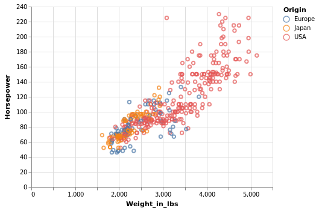
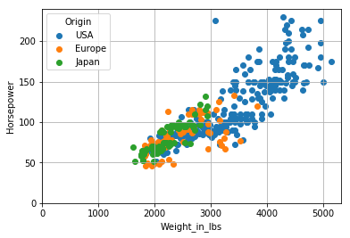
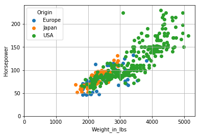

# Making a Complex Scatter Plot
At the time of writing, mpl-altair does not support bar charts, so this post will show how to create a bar chart in Altair, Matplotlib, and how mpl-altair _should_ implement bar chart conversion in the future.

In the first part, we made a simple scatter plot. This post will look at a more complex plot.
We'll use the cars dataset again:
```python
from vega_datasets import data
cars = data.cars()
cars.head()
```
**Acceleration** | **Cylinders** | **Displacement** | **Horsepower** | **Miles_per_Gallon** | **Name** | **Origin** | **Weight_in_lbs** | **Year** 
:---: | :---: | :---: | :---: | :---: | :---: | :---: | :---: | :---:
12.0 | 8 | 307.0 | 130.0 | 18.0 | chevrolet chevelle malibu | USA | 3504 | 1970-01-01
11.5 | 8 | 350.0 | 165.0 | 15.0 | buick skylark 320 | USA | 3693 | 1970-01-01
11.0 | 8 | 318.0 | 150.0 | 18.0 | plymouth satellite | USA | 3436 | 1970-01-01
12.0 | 8 | 304.0 | 150.0 | 16.0 | amc rebel sst | USA | 3433 | 1970-01-01
10.5 | 8 | 302.0 | 140.0 | 17.0 | ford torino | USA | 3449 | 1970-01-01

In addition to looking at Horsepower vs Weight, let's color each point by its origin country.

## Altair
Since Altair is based on linking columns to encodings, we just have to specify 
that the color encoding comes from the Origin column.

Also, notice that a legend is automatically generated.
```python
import altair as alt
alt.Chart(cars).mark_point().encode(
    alt.X('Weight_in_lbs'),
    alt.Y('Horsepower'),
    alt.Color('Origin')
)
```


## Matplotlib
If we wanted to color our points by a quantitative variable, we could have just 
used 
```python
ax.scatter('Weight_in_lbs', 'Horsepower', c='quantitative_column', data=cars)
```
However, the scatter function currently doesn't allow scalar mappables for categorical data. 
So, we have to plot points from each country as separate scatter plots on the same axes object.

There are a couple options for this. One is to create subsets of your data via `df['col'].unique()`. Another is to use the `df.groupby('col')` function to create the subset within the for loop.

Specifying the label as a parameter in scatter allows us to call `ax.legend()` to generate a legend.
```python
import matplotlib.pyplot as plt
```
```python
# Option 1: df['col'].unique()
fig, ax = plt.subplots()
for car in cars['Origin'].unique():
    d_ = cars[cars['Origin'] == car]
    ax.scatter(data=d_, x='Weight_in_lbs', y='Horsepower', label=car)
ax.set_xlabel('Weight_in_lbs')
ax.set_ylabel('Horsepower')
ax.set_xlim([0, None])
ax.set_ylim([0, None])
ax.legend(title='Origin')
plt.grid()
plt.show()
```


```python
# Option 2: df.groupby()
fig, ax = plt.subplots()
for car_origin, cars_subset in cars.groupby(['Origin']):
    ax.scatter(data=cars_subset, x='Weight_in_lbs', y='Horsepower', label=car_origin)
ax.set_xlabel('Weight_in_lbs')
ax.set_ylabel('Horsepower')
ax.set_xlim([0, None])
ax.set_ylim([0, None])
ax.legend(title='Origin')
plt.grid()
plt.show()
```


## mpl-altair
At the time of writing, mpl-altair doesn't support bar charts.

If mpl-altair supported bar charts, this is how an Altair chart would get rendered in mpl-altair:
```python
import altair as alt
import matplotlib.pyplot as plt
import mplaltair
chart = alt.Chart(cars).mark_point().encode(
    alt.X('Weight_in_lbs'),
    alt.Y('Horsepower'),
    alt.Color('Origin')
)
fig, ax = mplaltair.convert(chart)
plt.show()
```